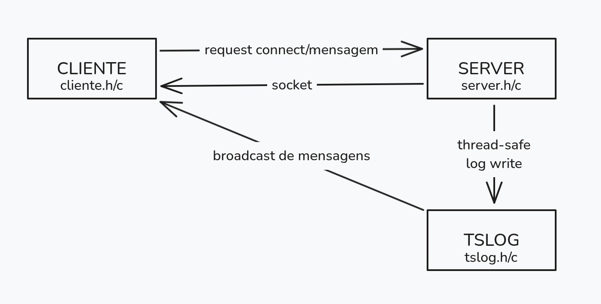
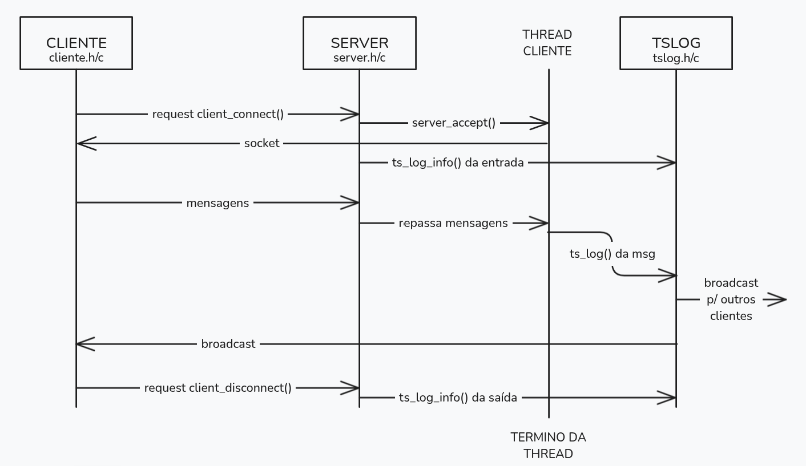

# THREAD-TCP-LPII-251-E003

## _[LPII-251-E003-1]_ Biblioteca libtslog + Arquitetura

### Instruções de Uso

Basta apenas rodar os seguintes comandos no bash.

```bash
make
./log_test
```

Então será escrito no terminal as saídas e criado um arquivo `test.log` onde o output dos logs será mostrado. Para a limpeza é só utilizar:

```bash
make clean
```

### Comentários

Na Etapa 1 o foco está apenas na biblioteca de logging, sem ainda envolver sockets ou comunicação entre clientes.
O funcionamento se concentra nas funções do tslog.

- A inicialização é feita com `tslog_init`, que abre o arquivo de log e prepara o mutex que garantirá exclusão mútua.

- `tslog_vlog` é a função que permite o registro de mensagens no log pelas threads.
  - `tslog_log` é o log genérico, sem adição de informação à mensagem.
  - `tslog_warn`, `tslog_error` e `ts_info` são todas variações de `tslog_log` por motivos organizacionais.

> Dentro de `tslog_vlog`, primeiro ocorre o bloqueio do mutex para impedir escrita concorrente desordenada. Em seguida é gerado um carimbo de tempo e o identificador da thread, compondo o prefixo da linha. Depois, `vfprintf` usa a string `fmt` e os argumentos passados para montar a mensagem final, que é gravada no arquivo junto ao prefixo e ao nível. Ao terminar, ocorre o flush para garantir persistência imediata no arquivo, e finalmente o mutex é liberado.

- A função `tslog_close` é chamada para fechar o arquivo e destruir o mutex.

Assim, a Etapa 1 encapsula num módulo thread-safe toda a lógica de logging, de modo que nas próximas etapas servidor e cliente apenas chamem funções como tslog_info("Mensagem...") com baixa a nenhuma preocupação com sincronização ou formatação.

### Diagramas




