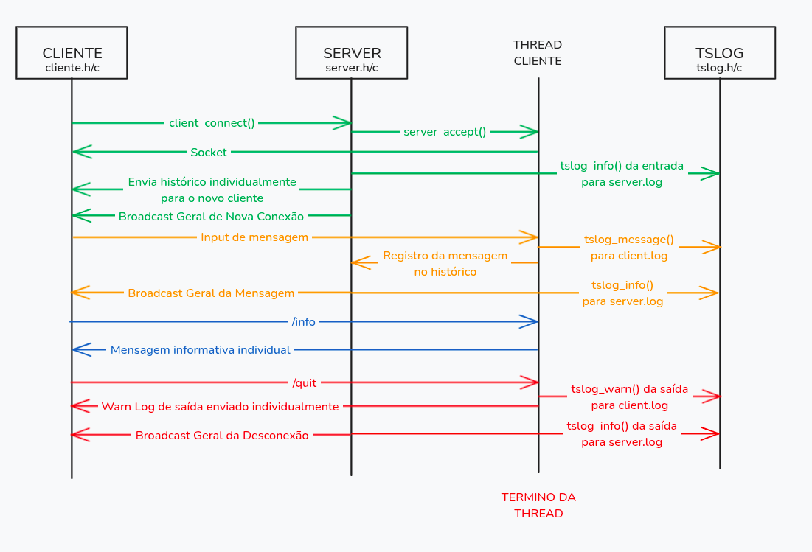

# THREAD-TCP-LPII-251-E003

## _[LPII-251-E003-1]_ Biblioteca libtslog + Arquitetura

### Instruções de Uso

Basta apenas rodar os seguintes comandos no bash.

```bash
make
./log_test
```

Então será escrito no terminal as saídas e criado um arquivo `test.log` onde o output dos logs será mostrado. Para a limpeza é só utilizar:

```bash
make clean
```

### Comentários

Na Etapa 1 o foco está apenas na biblioteca de logging, sem ainda envolver sockets ou comunicação entre clientes.
O funcionamento se concentra nas funções do tslog.

- A inicialização é feita com `tslog_init`, que abre o arquivo de log e prepara o mutex que garantirá exclusão mútua.

- `tslog_vlog` é a função que permite o registro de mensagens no log pelas threads.
  - `tslog_log` é o log genérico, sem adição de informação à mensagem.
  - `tslog_warn`, `tslog_error` e `ts_info` são todas variações de `tslog_log` por motivos organizacionais.

> Dentro de `tslog_vlog`, primeiro ocorre o bloqueio do mutex para impedir escrita concorrente desordenada. Em seguida é gerado um carimbo de tempo e o identificador da thread, compondo o prefixo da linha. Depois, `vfprintf` usa a string `fmt` e os argumentos passados para montar a mensagem final, que é gravada no arquivo junto ao prefixo e ao nível. Ao terminar, ocorre o flush para garantir persistência imediata no arquivo, e finalmente o mutex é liberado.

- A função `tslog_close` é chamada para fechar o arquivo e destruir o mutex.

Assim, a Etapa 1 encapsula num módulo thread-safe toda a lógica de logging, de modo que nas próximas etapas servidor e cliente apenas chamem funções como tslog_info("Mensagem...") com baixa a nenhuma preocupação com sincronização ou formatação.

### Diagramas


## _[LPII-251-E003-2]_ Testes com Servidor e Clientes TCP

### Instruções de Uso

Primeiramente, para garantir que os scripts estejam com permissão de executar, use os seguintes comandos.

```bash
chmod +x v2_test.sh
chmod +x v2_teste_manual.sh
```

Para testar a comunicação entre servidor e clientes TCP, utilize o script `v2_test.sh` que automatiza a execução do servidor e de dois clientes.

```bash
./v2_test.sh
```

Para testar de forma manual use o script `v2_teste_manual.sh`

```bash
./v2_teste_manual.sh
```

## _[LPII-251-E003-2]_ Testes com Servidor e Clientes TCP

### Diagrama



### Mapeamento de Requisitos ao Código

| **Requisito**                                       | **Implementação no Código**                                                                 |
| --------------------------------------------------- | ------------------------------------------------------------------------------------------- |
| Comunicação TCP entre múltiplos clientes e servidor | `server.c` (`accept`, `recv`, `send`, `broadcast`) / `client.c` (`connect`, `send`, `recv`) |
| Histórico de mensagens                              | Estrutura `MessageHistory` e funções `history_add`, `history_send_all` em `server.c`        |
| Identificação de cliente por nome                   | `client_run()` — leitura do nome e prefixo `[nome]: msg`                                    |
| Logging thread-safe                                 | Biblioteca `libtslog` (`tslog.c`, `tslog.h`) — usada em todas as threads                    |
| Recepção assíncrona de mensagens                    | `receive_handler` (thread dedicada no cliente)                                              |
| Broadcast de mensagens                              | `broadcast()` — envio a todos os clientes conectados                                        |
| Script de testes automáticos                        | `v2_test.sh` — executa servidor e múltiplos clientes simultaneamente                        |
| Finalização segura e limpeza                        | `server_stop()`, `make clean`, tratamento de sinal `SIGPIPE`                                |


### Uso de IA

Durante o desenvolvimento, foi empregada análise assistida por IA para depurar falhas de segmentação no cliente (além do uso de ferramentas de diagnóstico como o valgrind), identificando condições de corrida e erros de ponteiro, além de refatorar a arquitetura de threads e sincronização com o uso de atomic_int e mutexes. A IA auxiliou também na revisão do protocolo de mensagens, garantindo consistência entre recv e send_full, e na criação de scripts de teste automatizados com múltiplos terminais para simular sessões reais.

### Demonstração


*(Em caso de falha do GitHub em mostrar o embed, o vídeo se encontra em /assets/DEMO_LPII003 em formatos .mov e .mp4)*